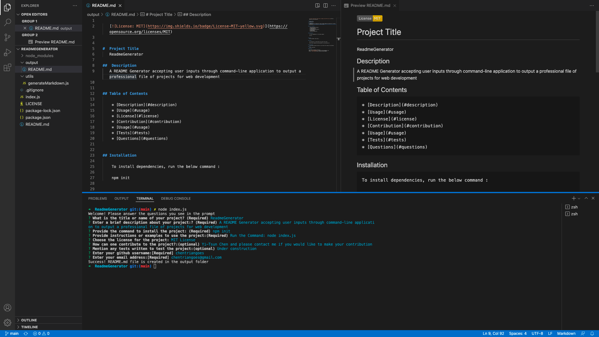

# 🖥 ReadmeGenerator

## 📋 Description

This project is to create a command-line application of a README file generator. A series of questions will be prompted to present questions accepting user inputs. An output of a Readme file is expected to get generated to include information such as the Licese for this project and stored in folder of the output.

## 🗂 Table of Contents

* [Description](#description)
* [Demonstration](#demonstration)
* [Technologies](#technologies)
* [License](#license)
* [Questions](#questions)

### 📽 Demonstration

Demo video: [Professional README Generator Demo](https://drive.google.com/file/d/1B-VbhKxNS61x0r8nrD-f2ahr1iPVaG2x/view?usp=sharing)

### 📷 Output Readme

## 🕹 Technologies

* [Node.js](https://nodejs.org/)
* [Inquirer.js](https://www.npmjs.com/package/inquirer)

## 🛡 License

This repository is licensed under the [MIT license](./LICENSE).

## ☎️ Questions

For any questions about the project/repository please contact me @ [chentriangoes@gmail.com](mailto:chentriangoes@gmail.com)  
GitHub @ [chentriangoes](https://github.com/chentriangoes) 

